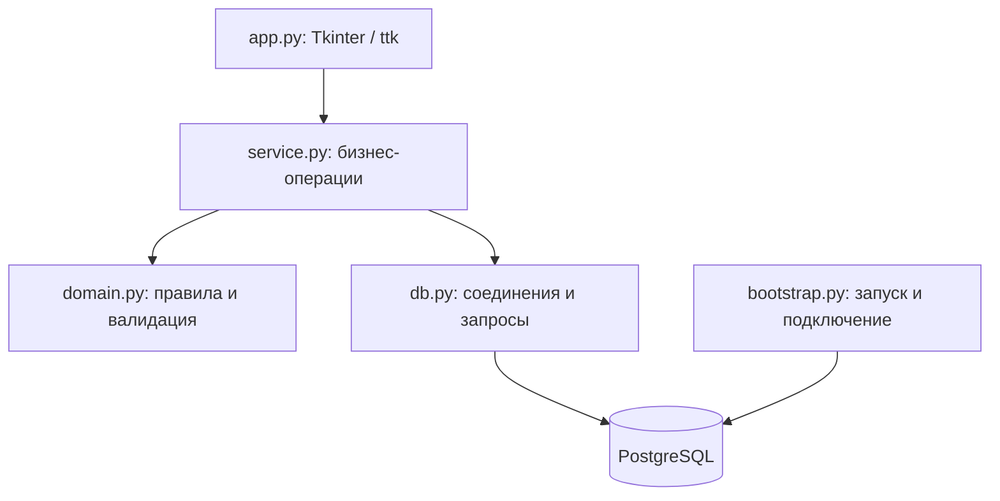
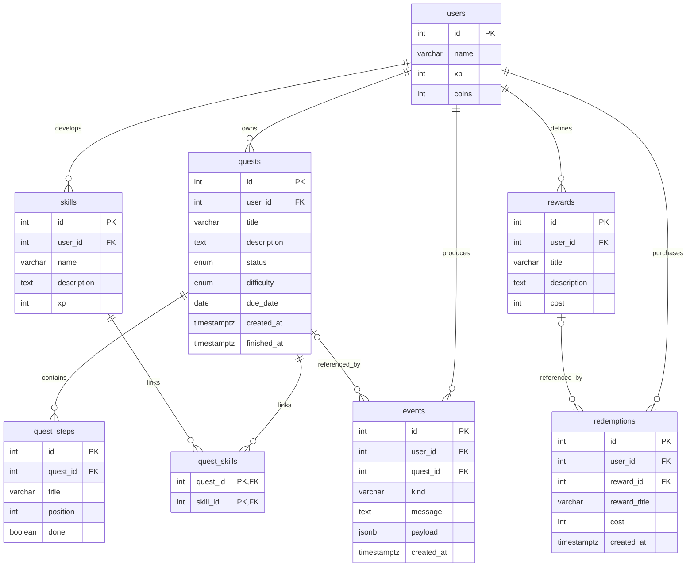
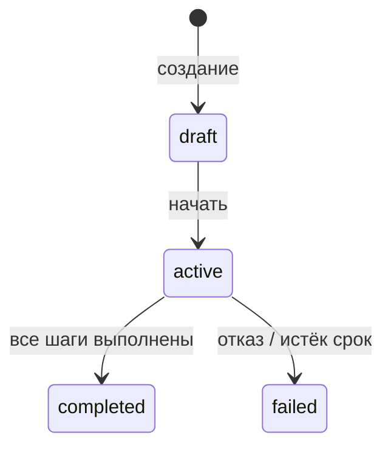

# Проектирование QuestDesk

## Концепция

Пользователь превращает учебные и личные планы в квесты с конкретными шагами.
Результат действий отражается в состоянии профиля: опыте, уровне, монетах,
прогрессе навыков и журнале. Внутренние монеты обмениваются на личные награды.

## Техническое задание

Цель: создать настольную систему управления личными квестами и мотивацией.
Роль в интерфейсе: один владелец локального профиля.

Функциональные требования: полный цикл работы с квестами, шаги, связи с навыками,
фильтрация, начисление наград, обработка отказа и просрочки, справочники,
покупка наград, история, сохранение между запусками.

Нефункциональные требования: русский интерфейс, Windows x64, PostgreSQL,
параметризованные SQL-запросы, атомарность изменений, осмысленный seed,
проверка ввода, локальное хранение секретов, воспроизводимые автоматические тесты.
Сервер слушает только loopback. Сеть нужна лишь для установки зависимостей из исходников.

## Слои

UI не начисляет опыт и не изменяет баланс напрямую. Сервис проверяет переходы
состояний и выполняет операции в контексте соединения Psycopg: успешный выход
фиксирует транзакцию, исключение откатывает её. SQL сосредоточен в слое данных
и сервисе; доменные функции не зависят от GUI или PostgreSQL.

## Модель данных

Связь 1:N: квест содержит несколько шагов. Связь N:M: один квест развивает несколько
навыков, один навык участвует в нескольких квестах; таблица quest_skills разрешает связь.
Составной первичный ключ исключает повторную пару квест-навык.
Уровень вычисляется из опыта, чтобы не хранить противоречивые значения.

users хранит профиль и накопленное состояние. skills — направления развития.
quests — задания и жизненный цикл. quest_steps — упорядоченные шаги.
quest_skills — связи квестов и навыков. rewards — каталог личных наград.
redemptions — факты покупок со снимком названия и цены. events — журнал.

CHECK защищают баланс, опыт, цены, непустые названия и согласованность finished_at
со статусом. UNIQUE защищают имена навыков/наград внутри профиля и порядок шагов.
ENUM задают допустимые состояния и сложности. JSONB используется только для
различающихся деталей событий: xp, coins, reason, title и source.
Основные связи и поля для расчётов остаются реляционными.

Индексы: поиск квестов по пользователю/статусу/сроку; события и покупки по времени;
обратный поиск связей навыка; внешние ключи событий и покупок; GIN по JSONB для
аналитических запросов. Поиск ILIKE по названию при учебном объёме выполняется
последовательным сканированием; обычный B-tree не выдаётся за ускорение подстроки.

## Состояния и транзакции

Все операции изменения сначала блокируют строку профиля через SELECT FOR UPDATE.
Затем читают актуальный квест/награду. Это единый порядок блокировок для одного
пользователя. Две конкурентные операции сериализуются: второе завершение увидит
completed, вторая покупка увидит уже уменьшенный баланс.

Завершение: проверить active и срок → проверить шаги → изменить статус → начислить
профилю XP/монеты → начислить навыкам XP → записать JSONB-событие → COMMIT.
При любой ошибке ни один из этих результатов не сохраняется отдельно.

## Прототип экранов

Постоянная левая панель: Обзор / Мои квесты / Навыки / Награды / История.
Верхняя строка: профиль, уровень, баланс, изменение имени, обновление.
Обзор: четыре показателя, шкала опыта, следующий квест, последние события.
Список: поиск, фильтр, таблица, создание, переход в детали.
Детали/действие: описание, срок, награды, связанные навыки, отметки шагов,
начало/завершение/отказ. Формы открываются отдельно и проверяют введённые данные.

## Роли для распределения в группе

Имена участников не заданы. Перед сдачей укажите реальных исполнителей:

1. Backend / бизнес-логика: domain.py, service.py, правила состояния и транзакции.
2. База данных: schema.sql, seed.sql, индексы, целостность и PostgreSQL.
3. UI/UX: app.py, навигация, формы, отображение ошибок и прогресса.
4. Интеграция и тестирование (опционально): bootstrap.py, tests, сборка и демонстрация.
